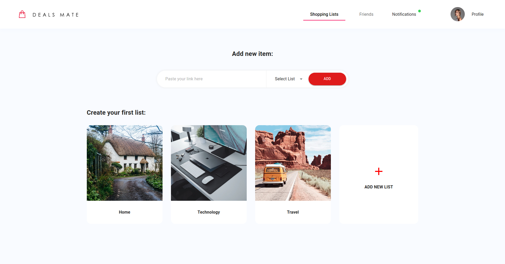
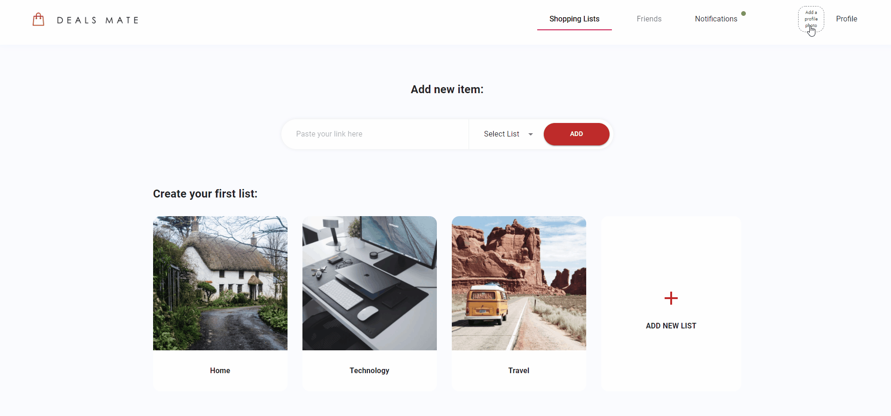
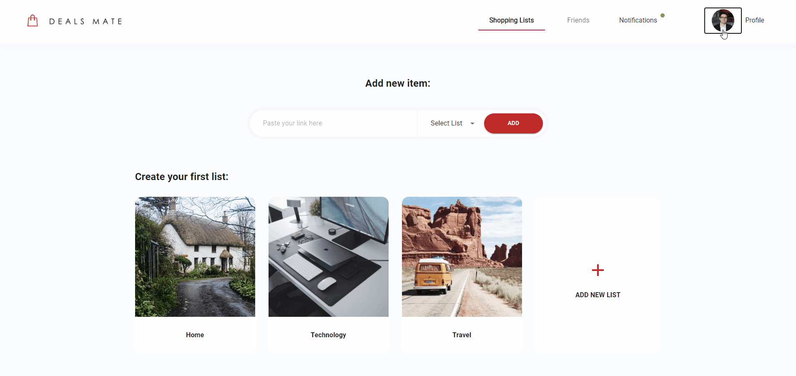
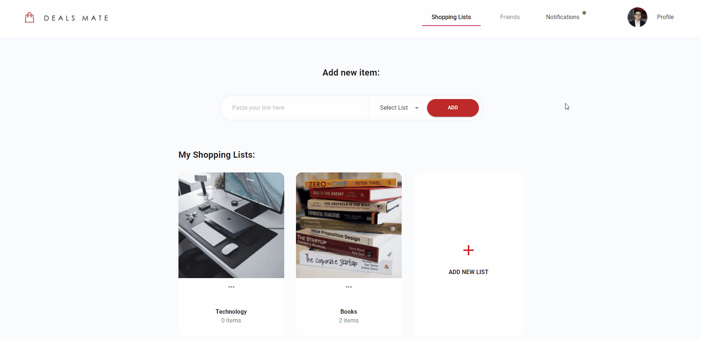

    

Dealsmate is an online marketplace that allows users to create and follow shopping lists that notifies them when items are on sale.

# Features

-   Create and share lists shopping lists with friends
-   Easily import Amazon URLs to lists
-   Get notifications when items go on sale
-   Follow your friends lists to see what items they want
-   Make private lists for sensitive items/presents/etc.

# Contents

-   [Usage](#Usage)
    -   [Signup](#Signup)
    -   [Adding a profile photo](#Adding-a-profile-photo)
    -   [Creating lists](#Creating-lists)
    -   [Adding products to lists](#Adding-products-to-lists)
    -   [Following friends](#Following-friends)
-   [Development](#Development)

# Usage

## Signup

To get started create an account at the <a href='dealsmate.com/signup' >sign up page</a>.

On a successful signup you will be redirected to the app dashboard.

## Adding a profile photo

Once in the app let's first add a profile photo.

Click on the `Add a profile photo` button in the top right and open the file you want to use:

You will now have a profile photo that is visible to friends!

## Creating lists

Next let's create your first list.

Either select from one of the default lists, or click `ADD NEW LIST` and select a name and image to use.

## Adding products to lists

Now that you have a list it's time to add some items:

1. Click on the list you want to add to
2. Click add new item
3. Go to Amazon and copy the URL of the product you want
4. Click the find item button
5. Click the add item button

## Following friends

You can follow a friends profile to get updates on their public lists:

1. Click on the `Friends` tab
2. Click on the `Explore` tab to find users not in your network
3. Click the follow button next to the user you want to follow
4. Go to the `Following` tab to see who you are following
5. Click a users name to view their profile

# Development

<ul>
    <li><a href="./docs/local_setup.md">Local Setup README</a></li>
    <li><a href="./docs/api_usage.md">API Usage README</a></li>
</ul>
